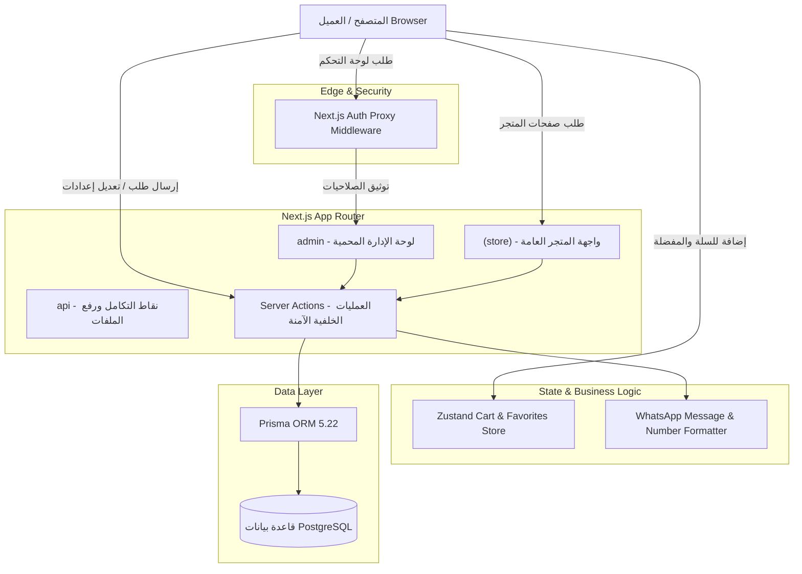
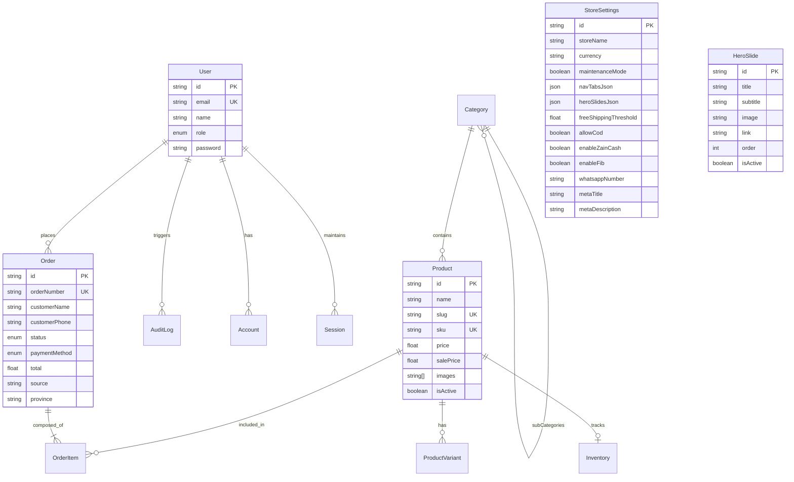

# 📐 المعمارية البرمجية والهندسية | System Architecture
### منصة گِفتي بلس (Gifty Plus Architecture Guide)

---

## 1. نظرة عامة على المعمارية (Architectural Overview)

تم بناء مشروع **گِفتي بلس** بالاعتماد على معمارية **Next.js Full-Stack Modern Architecture** باستخدام محرك **Turbopack** الأحدث ومكتبة **React 19**، مع اتباع نمط **App Router** الذي يتيح الفصل المنطقي المحكم بين تجربة الزبائن العامة (Storefront) واللوحة التنفيذية المحمية للإدارة (Admin Panel).



---

## 2. هيكلية المسارات (Route Hierarchy & Separation)

تم تقسيم مسارات التطبيق داخل مجلد `src/app` إلى فئتين رئيسيتين:

### أ. واجهة المتجر `src/app/(store)`
مسارات عامة فائقة السرعة تستفيد من تقنيات **Server-Side Rendering (SSR)** و **Streaming** لتوفير أفضل أداء وظهور في محركات البحث (SEO):
- `/`: الصفحة الرئيسية الفاخرة، تضم السلايدر التفاعلي، دليل الإهداء، الأقسام، والمزايا.
- `/shop`: صفحة الكتالوج العام مع الفرز والتصفية المتقدمة حسب السعر والتصنيف.
- `/category/[slug]`: صفحات التصنيفات المخصصة مع عروض فرعية وبانرات موجهة.
- `/product/[id]`: صفحة تفاصيل المنتج، معرض الصور، وتنسيق بطاقة الإهداء والتغليف.
- `/gift-finder`: خوارزمية تفاعلية لمساعدة الزبائن في العثور على الهدية بحسب المناسبة والميزانية.
- `/cart` & `/checkout`: سلة الشراء الذكية، حساب تكلفة التوصيل، والدفع عبر واتساب أو الوسائل المحلية.
- `/track-order`: استعلام فوري عن حالة الطلب ومساره باستخدام رقم الهاتف أو رقم الطلب.

### ب. لوحة الإدارة `src/app/admin`
منطقة تشغيلية مؤمنة مخصصة لمدراء المتجر والموظفين مع نظام التحقق من الأدوار (RBAC):
- `/admin`: لوحة مؤشرات الأداء اللحظية (KPIs)، الإيرادات، وتوزيع المبيعات.
- `/admin/products`: إدارة المنتجات بنظام البوكس العائم التفاعلي (Floating Modal).
- `/admin/orders`: إدارة دورة حياة الطلبات وتوليد إشعارات الواتساب بنقرة واحدة.
- `/admin/categories`: تنظيم الشجرة التصنيفية ورفع بانرات الأقسام.
- `/admin/hero-slides`: استوديو إدارة شرائح العرض وتحديد أولويات الظهور.
- `/admin/settings`: محرك تخصيص وتعديل واجهة وسلوكيات المتجر المبوب من 4 محاور رئيسية.
- `/admin/users`: إدارة صلاحيات الفريق وسجلات المتابعة والتدقيق (Audit Logs).

---

## 3. مخطط علاقات قاعدة البيانات (Entity Relationship Diagram - ERD)

تعتمد المنصة على قاعدة بيانات **PostgreSQL** تديرها طبقة **Prisma ORM**، مما يضمن تكاملاً صارماً في الأنواع (Type-Safety) وسرعة استجابة عالية:



---

## 4. نموذج تدفق البيانات وإجراءات السيرفر (Data Flow & Server Actions)

تعتمد المنصة على **Next.js Server Actions** كبديل عصري لنقاط REST API التقليدية للعمليات الحساسة، مما يحقق الفوائد التالية:
1. **Zero Client-Side API Exposure:** العمليات البرمجية الحساسة لا تكشف عن عناوين الـ API ولا بنية الاستعلامات.
2. **Automatic Type Safety:** الأنواع مدعومة بالكامل وبشكل مباشر من السيرفر إلى المتصفح عبر TypeScript.
3. **Optimistic UI Updates:** تحديث الواجهة فوراً مع استعادة الحالة في حال حدوث أي خطأ عبر مكتبة `sonner` التنبيهية.

### مسار حفظ الإعدادات على سبيل المثال:
```text
Admin Browser (Client)
   │
   ▼  [Settings Form Inputs - reactive useState]
   │
   ▼  Calls updateStoreSettings(settingsData) (Server Action)
   │
   ├─► Verify Admin Session (NextAuth auth())
   ├─► Validate Fields (Zod / Type Check)
   ├─► Prisma upsert into StoreSettings (id: "default")
   ├─► revalidatePath('/') & revalidatePath('/admin/settings')
   │
   ▼  Return { success: true }
   │
Admin Browser displays Toast ("تم حفظ إعدادات المتجر بنجاح!")
```

---

## 5. إدارة الحالة في واجهة المستخدم (State Management Strategy)

- **السلة والمفضلة (Client-Side Persistence):**
  تستخدم مكتبة **Zustand** عبر الملف `src/lib/store.ts` مع تفعيل خاصية الـ `persist` لتخزين عناصر السلة والمنتجات المفضلة في `localStorage` للمتصفح دون الحاجة لتسجيل دخول إلزامي، مما يرفع معدل إتمام الطلبات (Conversion Rate).
- **التنقل والفلترة (URL Search Params as State):**
  تعتمد فلاتر المتجر (التصنيفات، نطاق الأسعار، الترتيب، تبويبات الإدارة) على عنوان الرابط `URLSearchParams` كـ Single Source of Truth، مما يمكن الزبائن والمدراء من مشاركة الروابط المفلترة والاحتفاظ بحالة الصفحة بدقة عند التحديث.

---

## 6. نظام الألوان وهوية التصميم (Design System & Color Tokens)

تم اختيار نظام ألوان مستوحى من فخامة علب الهدايا الملكية:

| الرمز البرمجي | اللون | المعنى والاستخدام |
| :--- | :--- | :--- |
| `#13213c` | Royal Navy (الكحلي الملكي) | لون العلامة التجارية الأساسي، الترويسة، والأزرار الرئيسية |
| `#22385e` | Deep Blue (الأزرق النيلي) | التدرجات اللونية، بطاقات التمييز، وشارات الثقة |
| `#D97706` / `#F59E0B` | Imperial Gold (الذهبي الفاخر) | شارات العروض، تقييمات النجوم، والأيقونات المضيئة |
| `#FAFAF8` | Alabaster Cream (البيج العاجي) | خلفية المتجر الرئيسية لتوفير تجربة قراءة مريحة وفاخرة |
| `#E8E4DF` | Warm Sand Border (الرمل الدافئ) | حدود البطاقات والقوائم المنفصلة بأناقة بالغة |

---

## 7. أمان النظام والصلاحيات (Security & RBAC)

1. **حماية التوجيه بالـ Middleware:**
   يقوم الملف `src/middleware.ts` باعتراض جميع الطلبات المتجهة إلى مسارات `/admin/*` للتحقق من وجود جلسة صالحة وأن دور المستخدم يملك صلاحيات وصول إدارية.
2. **تشفير كلمات المرور:**
   تشفير أحادي الاتجاه عبر خوارزمية **BcryptJS** مع 10 جولات تمليح (Salt Rounds).
3. **أمان قاعدة البيانات:**
   منع هجمات حقن SQL تلقائياً عبر صياغة الاستعلامات البارامترية في Prisma.
